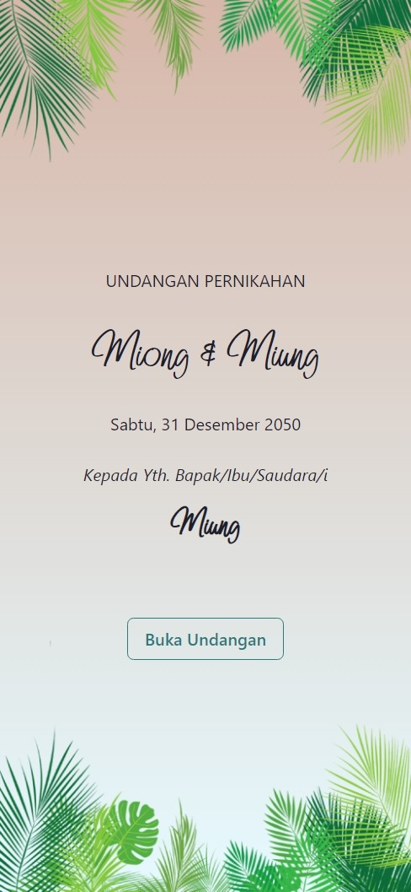
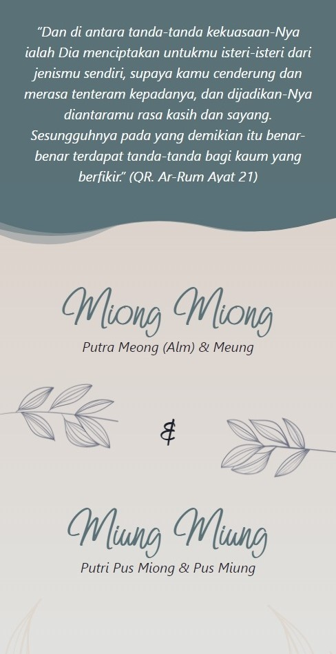

# Movie App

This application is developed by using VITE, REACT, TYPESCRIPT, CHAKRA-UI.

DEMO [wedding-invitation-fawn-pi.vercel.app](wedding-invitation-fawn-pi.vercel.app)

## Screenshots






## Run Locally

Clone the project at https://github.com/anggaalfiansah/wedding-invitation.git

Go to the project directory

Install dependencies

```bash
  yarn install
```

run program

```bash
  yarn start
```

build

```bash
  yarn run build
```

preview build

```bash
  yarn run preview
```

## License

[MIT](https://choosealicense.com/licenses/mit/)
